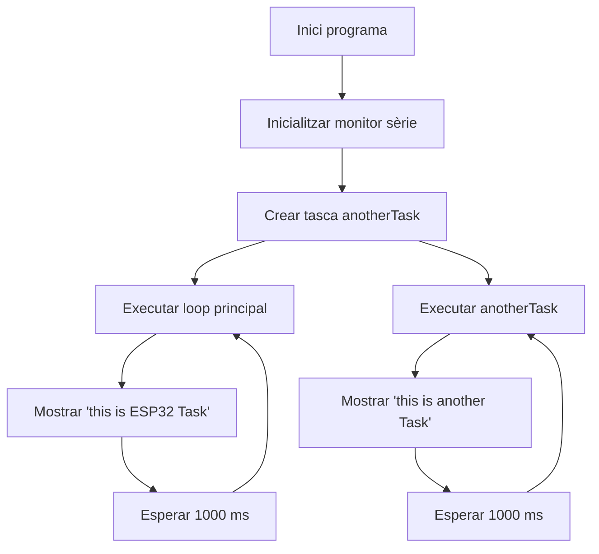

# Informe Pràctica 4A: Multitasca amb FreeRTOS

**Autors:** Joel Serrano i Ana Jimenez

**Microcontrolador:** ESP32-S3-DevKitC-1

---

## 1. Objectiu de la pràctica

L’objectiu d’aquesta pràctica és comprendre el funcionament de les tasques en temps real utilitzant FreeRTOS a la placa ESP32-S3.

Per aconseguir-ho, hem creat dues tasques independents que s’executen simultàniament i mostren missatges diferents pel monitor sèrie.

## 2. Desenvolupament de la pràctica

Per realitzar aquesta pràctica hem utilitzat el sistema operatiu en temps real FreeRTOS, integrat de manera nativa a l’ESP32-S3.

El programa crea una tasca addicional mitjançant la funció `xTaskCreate()`, mentre que la funció `loop()` continua executant-se de forma independent.

D’aquesta manera, podem observar com diferents tasques comparteixen el temps de processador i s’executen de manera concurrent.

## 3. Codi principal (`main.cpp`)

El següent codi crea una tasca addicional utilitzant FreeRTOS mentre la funció principal `loop()` continua executant-se de forma independent.

```cpp
#include <Arduino.h>

void anotherTask(void * parameter);

void setup()
{
  Serial.begin(115200);

  xTaskCreate(
    anotherTask,
    "another Task",
    10000,
    NULL,
    1,
    NULL
  );
}

void loop() {

  Serial.println("this is ESP32 Task");

  delay(1000);
}

void anotherTask(void * parameter) {

  for(;;) {

    Serial.println("this is another Task");

    delay(1000);
  }

  vTaskDelete(NULL);
}
```

## 4. Funcionament del codi

Primer inicialitzem la comunicació sèrie dins de la funció `setup()`.

A continuació, utilitzem la funció `xTaskCreate()` per crear una nova tasca anomenada `anotherTask`. Aquesta tasca s’executarà de manera independent a la funció principal del programa.

La funció `loop()` mostra cada segon el missatge `"this is ESP32 Task"` pel monitor sèrie.

Paral·lelament, la funció `anotherTask()` conté un bucle infinit que imprimeix el missatge `"this is another Task"` també cada segon.

Gràcies a FreeRTOS, les dues tasques comparteixen el temps de processador i poden executar-se de forma concurrent.

## 5. Sortida pel monitor sèrie

Quan executem el programa, podem observar que les dues tasques escriuen missatges de forma alternada al monitor sèrie.

```text
this is ESP32 Task
this is another Task
this is ESP32 Task
this is another Task
this is ESP32 Task
this is another Task
```

Aquesta sortida demostra que FreeRTOS permet executar diverses tasques de manera concurrent compartint el temps de processador.

## 6. Diagrama de flux del programa



## 7. Conclusions

Amb aquesta pràctica hem après a crear i gestionar tasques utilitzant FreeRTOS a la placa ESP32-S3.

També hem comprovat com diverses tasques poden executar-se de manera concurrent compartint el temps de processador.

Finalment, aquesta pràctica ens ha ajudat a entendre els conceptes bàsics de la programació en temps real i el funcionament de la multitasca en sistemes embeguts.


